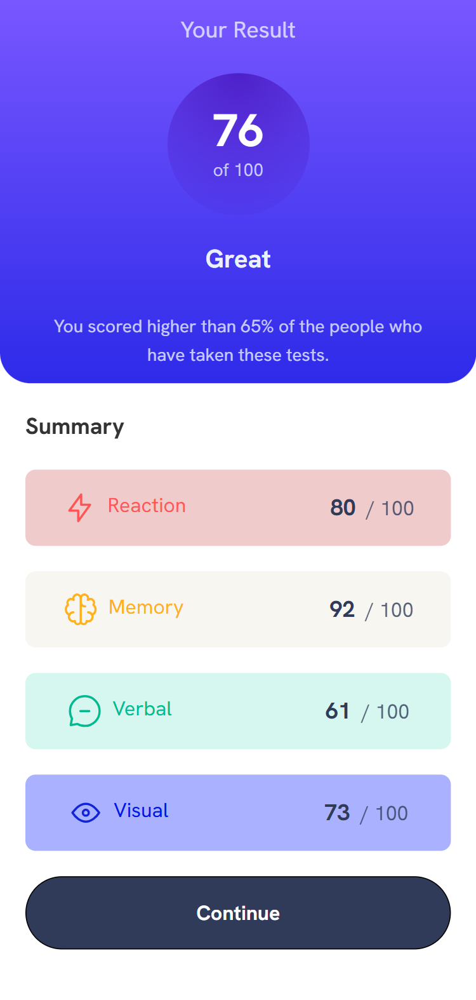

# Frontend Mentor - Results Summary Component

This is a solution to the [Results summary component challenge on Frontend Mentor](https://www.frontendmentor.io/challenges/results-summary-component-CE_K6s0maV). Frontend Mentor challenges help you improve your coding skills by building realistic projects.

## Table of contents

- [Overview](#overview)
  - [The challenge](#the-challenge)
  - [Screenshot](#screenshot)
  - [Links](#links)
- [My process](#my-process)
  - [Built with](#built-with)
  - [What I learned](#what-i-learned)
  - [Continued development](#continued-development)
- [Author](#author)

## Overview

### The challenge

Users should be able to:

- View the optimal layout for the interface depending on their device's screen size
- See hover and focus states for all interactive elements on the page
 

### Screenshot




### Links

- Solution URL: [Add your GitHub repo link here](https://github.com/your-username/your-repo)
- Live Site URL: [Add live demo link here](https://your-live-site-url.com)

## My process

### Built with

- Semantic **HTML5**
- **Tailwind CSS**
- Mobile-first responsive design
- Google Fonts: *Hanken Grotesk*

### What I learned

- How to implement responsive layouts using Tailwind’s utility classes.
- Creating gradient backgrounds and circular score indicators with Tailwind.
- Using custom color utilities with HSL values for design precision.

```html
<div class="bg-[radial-gradient(circle_at_top,hsla(256,72%,46%,1),hsla(241,72%,46%,0))]">
  <!-- Circular Score UI -->
</div>
